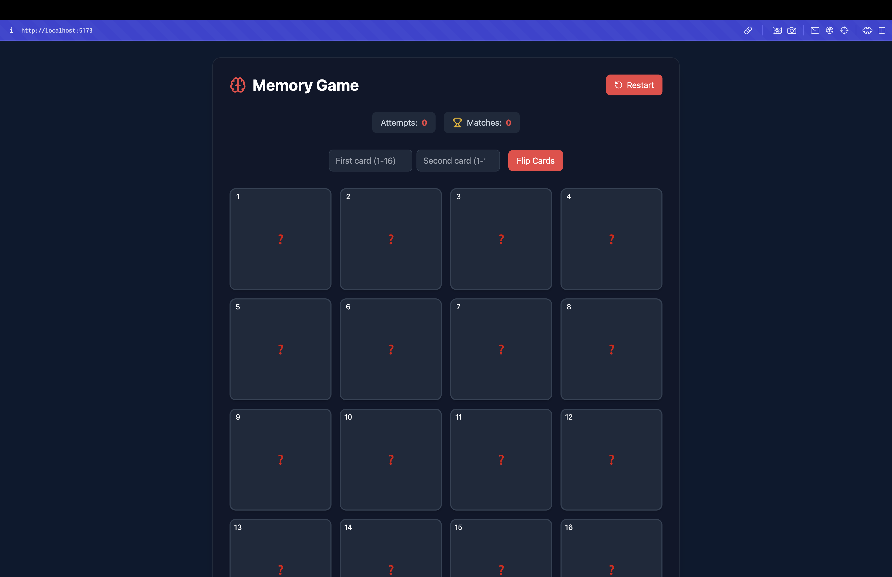

# Memory Card Game 🎮

A beautiful, responsive memory card game built with React, TypeScript, and Tailwind CSS. Test your memory by matching pairs of cards in this engaging web-based game.



## 🌟 Features

- **Interactive Gameplay**: Match pairs of cards by entering their numbers
- **Responsive Design**: Fully playable on both desktop and mobile devices
- **Modern UI**: Dark theme with navy blue background and red accents
- **Game Statistics**: Track attempts and matches in real-time
- **Animations**: Smooth card flip animations and victory celebration
- **Error Handling**: Clear feedback for invalid moves
- **Restart Functionality**: Reset the game at any time

## 🚀 Technologies Used

- React 18
- TypeScript
- Tailwind CSS
- Framer Motion (for animations)
- Lucide React (for icons)
- React Confetti (for victory celebration)

## 🎯 How to Play

1. The game consists of a 4x4 grid of cards (numbered 1-16)
2. Enter two card numbers in the input fields
3. Click "Flip Cards" to reveal the symbols
4. If the symbols match, they stay revealed
5. If they don't match, they flip back after 0.3 seconds
6. Continue until all pairs are matched
7. Try to win in the fewest attempts possible!

## 🛠️ Installation

1. Clone the repository:
   ```bash
   git clone https://github.com/DebdootManna/Memory-Card.git
   ```

2. Navigate to the project directory:
   ```bash
   cd memory-card-game
   ```

3. Install dependencies:
   ```bash
   npm install
   ```

4. Start the development server:
   ```bash
   npm run dev
   ```

5. Open your browser and visit `http://localhost:5173`

## 🏗️ Project Structure

```
memory-card-game/
├── src/
│   ├── components/
│   │   ├── Card.tsx
│   │   └── Confetti.tsx
│   ├── constants/
│   │   └── symbols.ts
│   ├── utils/
│   │   └── shuffle.ts
│   ├── App.tsx
│   └── main.tsx
├── public/
├── index.html
└── package.json
```

## 🎨 Customization

- Modify `symbols.ts` to change the card symbols
- Adjust card flip duration in `App.tsx`
- Customize colors in `tailwind.config.js`
- Modify animations in `Card.tsx`

## 📱 Responsive Design

The game is fully responsive and works on:
- Desktop computers
- Tablets
- Mobile phones

## 🤝 Contributing

1. Fork the repository
2. Create a new branch
3. Make your changes
4. Submit a pull request

## 📄 License

This project is licensed under the MIT License - see the [LICENSE](LICENSE) file for details.

## 🙏 Acknowledgments

- Icons provided by [Lucide React](https://lucide.dev)
- Animations powered by [Framer Motion](https://www.framer.com/motion)
- Confetti effects by [React Confetti](https://github.com/alampros/react-confetti)

## 🎮 Live Demo

[https://thememorygame.vercel.app/](#)

---

Made with ❤️ by Debdoot Manna